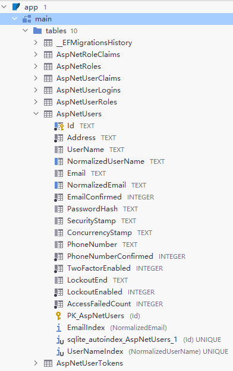
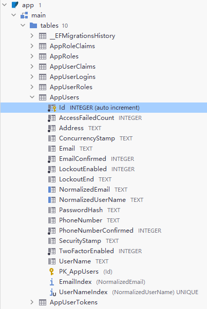

# 前言

用户模块几乎是每个系统必备的基础功能，如果每次开发一个新项目时都要做个用户模块，确实非常无聊。好在asp.net core给我们提供了Identity，使用起来也是比较方便，如果对用户这块需求不是非常个性化的话，identity是一个不错的选择。

> ASP.NET Core Identity:
>
> - 是一个 API，它支持用户 登录功能（UI界面) 。
>
> - 管理用户、密码、配置文件数据、角色、声明、令牌、电子邮件确认等。


# Web API中集成Identity 

*identity是支持UI界面的，如果不是前后端分离项目，可以直接集成identity UI模块，因为我这里使用Web API，就忽略掉identity UI部分。*


## 安装相关包

下面介绍以最小化方式引入identity。

首先创建一个Web API空项目，NuGet安装identity、efcore、jwt相关包，数据库我这里就使用Sqlite： 

```c#
<PackageReference Include="Microsoft.EntityFrameworkCore.Relational" Version="5.0.10" />
<PackageReference Include="Microsoft.EntityFrameworkCore.Sqlite" Version="5.0.10" />
<PackageReference Include="Microsoft.EntityFrameworkCore.Design" Version="5.0.10" />
<PackageReference Include="Microsoft.AspNetCore.Identity.EntityFrameworkCore" Version="5.0.10" />
```

## 自定义User，Context

创建自己的User实体，继承`IdentityUser`，`IdentityUser`中已经有一些基础字段，你可以在你的`AppUser`中额外定义一些自己需要的字段，比如`Address`：

```c#
public class AppUser : IdentityUser
{
    [Required] 
    [StringLength(128)] 
    public string Address { get; set; }
}
```

创建自己的DbContext，继承`IdentityDbContext<>`，泛型传入自己的`AppUser`：

```c#
public class AppDbContext : IdentityDbContext<AppUser>
{
    public AppDbContext(DbContextOptions<AppDbContext> options)
        : base(options)
    {
    }
}
```

在Startup中配置服务：

```c#
public void ConfigureServices(IServiceCollection services)
{
    services.AddControllers();

    services.AddDbContext<AppDbContext>(options =>
        options.UseSqlite(Configuration.GetConnectionString("DefaultConnection")));
    
    services.AddIdentityCore<AppUser>().AddEntityFrameworkStores<AppDbContext>();
}
```

appsettings.json：

```json
"ConnectionStrings": {
  "DefaultConnection": "DataSource=app.db; Cache=Shared"
}
```

这样一个最简单的自定义配置就完成了。


## 数据库迁移

使用`dotnet ef`命令迁移：

```powershell
dotnet ef migrations add AppDbContext_Initial

dotnet ef database update
```

执行完成后已经生成了identity相关表：




## 修改主键类型/表名

identity用户，角色表的主键默认类型是string，默认值是`Guid.NewGuid().ToString()`，数据量不大时无所谓，否则可能存在性能问题。identity支持主键类型的修改；想要修改表名，修改字段长度等等，也是非常容易：

```c#
public class AppUser : IdentityUser<int>
{
    [Required] 
    [StringLength(128)] 
    public string Address { get; set; }
}
```

```c#
public class AppDbContext : IdentityDbContext<AppUser, IdentityRole<int>, int>
{
    public AppDbContext(DbContextOptions<AppDbContext> options)
        : base(options)
    {
    }
    protected override void OnModelCreating(ModelBuilder builder)
    {
        base.OnModelCreating(builder);
        
        builder.Entity<AppUser>(b => { b.ToTable("AppUsers"); });
        builder.Entity<IdentityUserClaim<int>>(b => { b.ToTable("AppUserClaims"); });
        builder.Entity<IdentityUserLogin<int>>(b => { b.ToTable("AppUserLogins"); });
        builder.Entity<IdentityUserToken<int>>(b => { b.ToTable("AppUserTokens"); });
        builder.Entity<IdentityRole<int>>(b => { b.ToTable("AppRoles"); });
        builder.Entity<IdentityRoleClaim<int>>(b => { b.ToTable("AppRoleClaims"); });
        builder.Entity<IdentityUserRole<int>>(b => { b.ToTable("AppUserRoles"); });
    }
}
```

修改完成后更新数据库：

```powershell
dotnet ef migrations add AppDbContext_Modify_PK_Type

dotnet ef database update
```

查看主键，表名已成功修改：




# 最后

本篇完成了identity的基本配置，下一篇将介绍如何使用identity完成用户注册登录，以及获取jwt token。


>参考：
>
>[ASP.NET Core 简介 Identity | Microsoft Docs](https://docs.microsoft.com/zh-cn/aspnet/core/security/authentication/identity?view=aspnetcore-5.0&tabs=visual-studio)
>
>[Mohamad Lawand - DEV Community](https://dev.to/moe23/comments)


