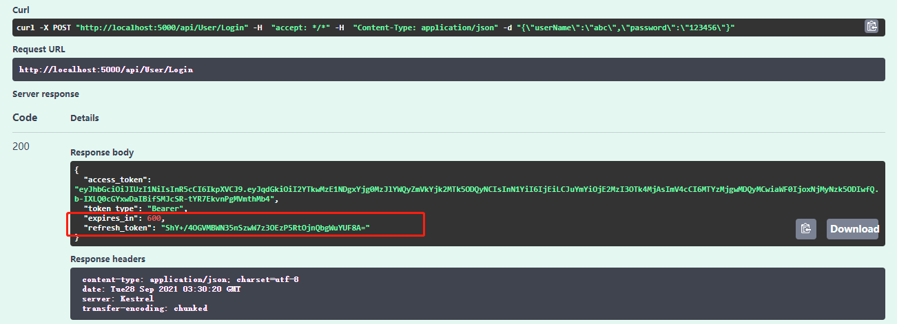
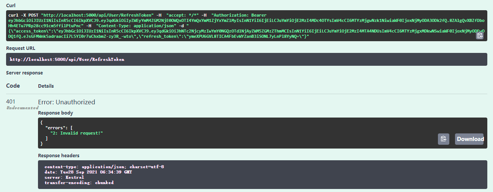
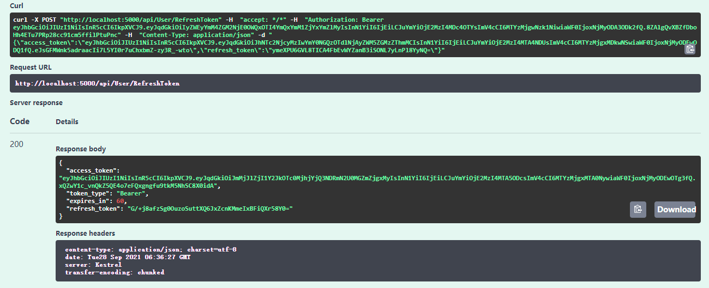
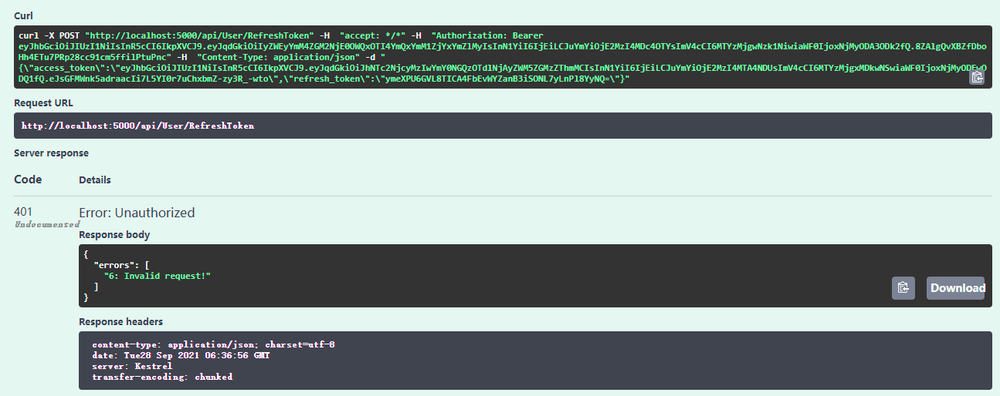

# 前言

上一篇已经介绍了identity的注册，登录，获取jwt token，本篇来完成refresh token。


# 开始

开始之前先说明一下为什么需要refresh token。

虽然jwt token有很多优点，但是它的缺点也是非常明显。由于jwt无状态的特性，所以jwt一旦颁发，基本上就不可控了，在过期时间内一直有效。有些场景下我们是希望能控制token失效的，比如用户的重要数据被修改时（密码，角色，权限，等等），我们希望用户重新获取token，甚至重新登录。

那么refresh token就可以很好的弥补jwt的缺陷。虽然refresh token也无法直接控制jwt失效，但是在refresh token机制下，我们可以把token的有效期设置的短一些，比如30分钟，而refresh token的有效期可以很长；因为refresh token会持久化到数据库中，它是完全可控的。

很多人纠结的jwt滑动刷新，无感刷新，在refresh token机制下，都不是问题。


## 生成refresh_token

改造一下上一篇的代码，首先refresh token需要持久化到数据库中，定义实体：

```c#
public class RefreshToken
{
    [Key]
    public int Id { get; set; }

    [Required]
    [StringLength(128)]
    public string JwtId { get; set; }

    [Required]
    [StringLength(256)]
    public string Token { get; set; }

    /// <summary>
    /// 是否使用，一个RefreshToken只能使用一次
    /// </summary>
    [Required]
    public bool Used { get; set; }

    /// <summary>
    /// 是否失效。修改用户重要信息时可将此字段更新为true，使用户重新登录
    /// </summary>
    [Required]
    public bool Invalidated { get; set; }

    [Required]
    public DateTime CreationTime { get; set; }

    [Required]
    public DateTime ExpiryTime { get; set; }

    [Required]
    public int UserId { get; set; }

    [Required]
    [ForeignKey(nameof(UserId))]
    public AppUser User { get; set; }
}
```

加入到DbContext：

```c#
public class AppDbContext : IdentityDbContext<AppUser, IdentityRole<int>, int>
{
    public DbSet<RefreshToken> RefreshTokens { get; set; }

    public AppDbContext(DbContextOptions<AppDbContext> options)
        : base(options)
    {
    }
    
    // 省略......
}
```

ef迁移：

```powershell
dotnet ef migrations add AppDbContext_Added_RefreshToken

dotnet ef database update
```

登录注册返回token时，也要把RefreshToken和ExpiresIn有效时间一起返回：

```c#
public class TokenResult
{
    public bool Success => Errors == null || !Errors.Any();
    public IEnumerable<string> Errors { get; set; }

    
    public string AccessToken { get; set; }

    public string TokenType { get; set; }

    public int ExpiresIn { get; set; }   // add
    
    public string RefreshToken { get; set; }  // add
}

```

```c#
public class TokenResponse
{
    [JsonPropertyName("access_token")] 
    public string AccessToken { get; set; }

    [JsonPropertyName("token_type")] 
    public string TokenType { get; set; }

    [JsonPropertyName("expires_in")]
    public int ExpiresIn { get; set; }  // add

    [JsonPropertyName("refresh_token")]
    public string RefreshToken { get; set; } // add
}
```

修改UserService创建token方法：

```c#
private async Task<TokenResult> GenerateJwtToken(AppUser user)
{
    var key = Encoding.ASCII.GetBytes(_jwtSettings.SecurityKey);

    var tokenDescriptor = new SecurityTokenDescriptor
    {
        Subject = new ClaimsIdentity(new[]
        {
            new Claim(JwtRegisteredClaimNames.Jti, Guid.NewGuid().ToString("N")),
            new Claim(JwtRegisteredClaimNames.Sub, user.Id.ToString())
        }),
        IssuedAt = DateTime.UtcNow,
        NotBefore = DateTime.UtcNow,
        Expires = DateTime.UtcNow.Add(_jwtSettings.ExpiresIn),
        SigningCredentials = new SigningCredentials(new SymmetricSecurityKey(key),
            SecurityAlgorithms.HmacSha256Signature)
    };

    var jwtTokenHandler = new JwtSecurityTokenHandler();
    var securityToken = jwtTokenHandler.CreateToken(tokenDescriptor);
    var token = jwtTokenHandler.WriteToken(securityToken);

    var refreshToken = new RefreshToken()
    {
        JwtId = securityToken.Id,
        UserId = user.Id,
        CreationTime = DateTime.UtcNow,
        ExpiryTime = DateTime.UtcNow.AddMonths(6),
        Token = GenerateRandomNumber()
    };

    await _appDbContext.RefreshTokens.AddAsync(refreshToken);
    await _appDbContext.SaveChangesAsync();

    return new TokenResult()
    {
        AccessToken = token,
        TokenType = "Bearer",
        RefreshToken = refreshToken.Token,
        ExpiresIn = (int)_jwtSettings.ExpiresIn.TotalSeconds,
    };
}
```

```c#
private string GenerateRandomNumber(int len = 32)
{
    var randomNumber = new byte[len];
    using var rng = RandomNumberGenerator.Create();
    rng.GetBytes(randomNumber);
    return Convert.ToBase64String(randomNumber);
}
```

登录测试，已经返回了refresh_token：




## 使用refresh_token获取token

```c#
// RefreshToken 请求参数
public class RefreshTokenRequest
{
    [JsonPropertyName("access_token")]
    public string AccessToken { get; set; }
    
    [JsonPropertyName("refresh_token")]
    public string RefreshToken { get; set; }
}
```

```c#
public interface IUserService
{
    // 省略......
    
    Task<TokenResult> RefreshTokenAsync(string token, string refreshToken); // add
}
```

`RefreshTokenAsync`实现：

```c#
public async Task<TokenResult> RefreshTokenAsync(string token, string refreshToken)
{
    var claimsPrincipal = GetClaimsPrincipalByToken(token);
    if (claimsPrincipal == null)
    {
        // 无效的token...
        return new TokenResult()
        {
            Errors = new[] { "1: Invalid request!" },
        };
    }

    var expiryDateUnix =
        long.Parse(claimsPrincipal.Claims.Single(x => x.Type == JwtRegisteredClaimNames.Exp).Value);
    var expiryDateTimeUtc = UnixTimeStampToDateTime(expiryDateUnix);
    if (expiryDateTimeUtc > DateTime.UtcNow)
    {
        // token未过期...
        return new TokenResult()
        {
            Errors = new[] { "2: Invalid request!" },
        };
    }

    var jti = claimsPrincipal.Claims.Single(x => x.Type == JwtRegisteredClaimNames.Jti).Value;

    var storedRefreshToken =
        await _appDbContext.RefreshTokens.SingleOrDefaultAsync(x => x.Token == refreshToken);
    if (storedRefreshToken == null)
    {
        // 无效的refresh_token...
        return new TokenResult()
        {
            Errors = new[] { "3: Invalid request!" },
        };
    }

    if (storedRefreshToken.ExpiryTime < DateTime.UtcNow)
    {
        // refresh_token已过期...
        return new TokenResult()
        {
            Errors = new[] { "4: Invalid request!" },
        };
    }

    if (storedRefreshToken.Invalidated)
    {
        // refresh_token已失效...
        return new TokenResult()
        {
            Errors = new[] { "5: Invalid request!" },
        };
    }

    if (storedRefreshToken.Used)
    {
        // refresh_token已使用...
        return new TokenResult()
        {
            Errors = new[] { "6: Invalid request!" },
        };
    }

    if (storedRefreshToken.JwtId != jti)
    {
        // refresh_token与此token不匹配...
        return new TokenResult()
        {
            Errors = new[] { "7: Invalid request!" },
        };
    }

    storedRefreshToken.Used = true;
    //_userDbContext.RefreshTokens.Update(storedRefreshToken);
    await _appDbContext.SaveChangesAsync();

    var dbUser = await _userManager.FindByIdAsync(storedRefreshToken.UserId.ToString());
    return await GenerateJwtToken(dbUser);
}
```

解析token，**注意这里的`tokenValidationParameters`，这个参数和Startup中设置的`tokenValidationParameters`唯一的区别是`ValidateLifetime = false`，不验证过期时间。**

```c#
private ClaimsPrincipal GetClaimsPrincipalByToken(string token)
{
    try
    {
        var tokenValidationParameters = new TokenValidationParameters
        {
            ValidateIssuer = false,
            ValidateAudience = false,
            ValidateIssuerSigningKey = true,
            IssuerSigningKey = new SymmetricSecurityKey(Encoding.ASCII.GetBytes(_jwtSettings.SecurityKey)),
            ClockSkew = TimeSpan.Zero,
            ValidateLifetime = false // 不验证过期时间！！！
        };

        var jwtTokenHandler = new JwtSecurityTokenHandler();

        var claimsPrincipal =
            jwtTokenHandler.ValidateToken(token, tokenValidationParameters, out var validatedToken);

        var validatedSecurityAlgorithm = validatedToken is JwtSecurityToken jwtSecurityToken
                                         && jwtSecurityToken.Header.Alg.Equals(SecurityAlgorithms.HmacSha256,
                                             StringComparison.InvariantCultureIgnoreCase);

        return validatedSecurityAlgorithm ? claimsPrincipal : null;
    }
    catch
    {
        return null;
    }
}
```

最后是UserController：

```c#
[HttpPost("RefreshToken")]
public async Task<IActionResult> RefreshToken(RefreshTokenRequest request)
{
    var result = await _userService.RefreshTokenAsync(request.AccessToken, request.RefreshToken);
    if (!result.Success)
    {
        return Unauthorized(new FailedResponse()
        {
            Errors = result.Errors
        });
    }

    return Ok(new TokenResponse
    {
        AccessToken = result.AccessToken,
        TokenType = result.TokenType,
        ExpiresIn = result.ExpiresIn,
        RefreshToken = result.RefreshToken
    });
}
```

测试token未过期时刷新token：



正常刷新token：



refresh_token使用一次后，不可以再次使用：



其他情况可以自行测试。。。


# 最后

本篇完成了refresh token相关功能，代码较多，已上传至 [blogs/asp.net core identity + jwt/code at main · xiajingren/blogs (github.com)](https://github.com/xiajingren/blogs/tree/main/asp.net core identity %2B jwt/code)


>参考：
>
>[ASP.NET Core 简介 Identity | Microsoft Docs](https://docs.microsoft.com/zh-cn/aspnet/core/security/authentication/identity?view=aspnetcore-5.0&tabs=visual-studio)
>
>[Mohamad Lawand - DEV Community](https://dev.to/moe23/comments)


