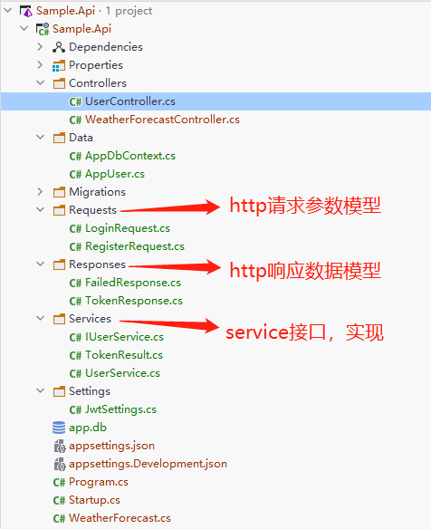
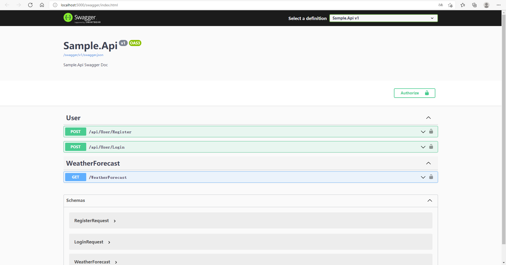
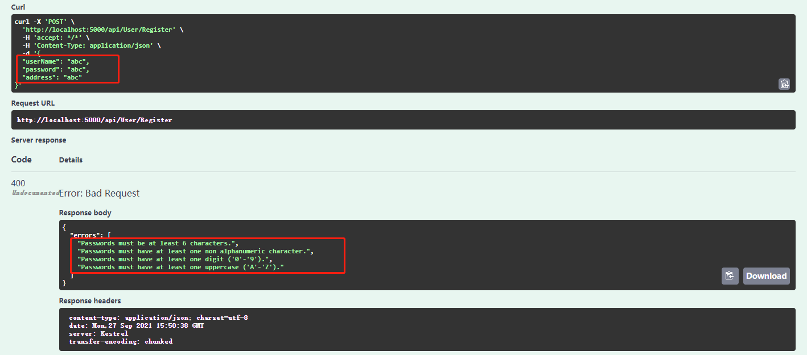
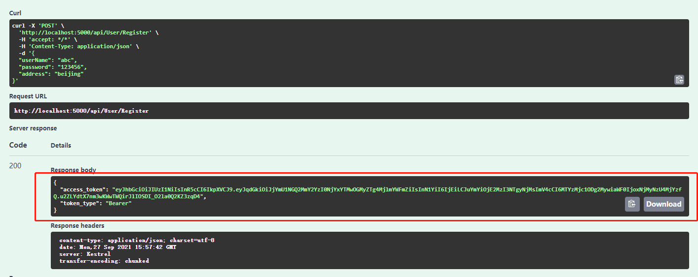
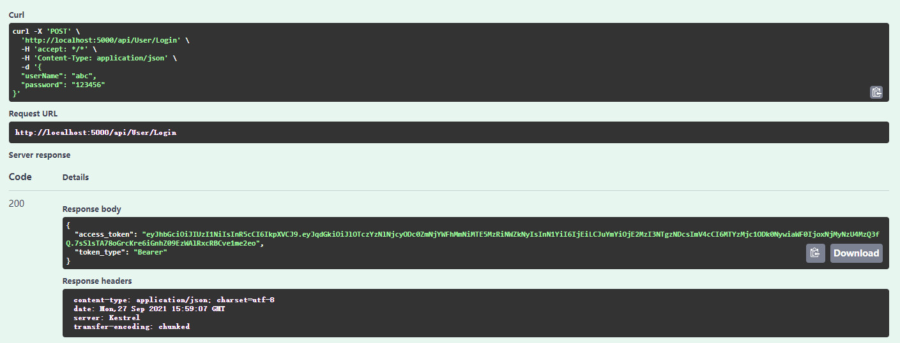

# 前言

上一篇已经介绍了identity在web api中的基本配置，本篇来完成用户的注册，登录，获取jwt token。


# 开始

开始之前先配置一下jwt相关服务。


## 配置JWT

首先NuGet安装包：

```c#
<PackageReference Include="Microsoft.AspNetCore.Authentication.JwtBearer" Version="5.0.10" />
```

appsettings.json中添加jwt配置：

```json
"JwtSettings": {
  "SecurityKey": "qP1yR9qH2xS0vW2lA3gI4nF0zA7fA3hB",
  "ExpiresIn": "00:10:00"
}
```

为了方便，新建一个配置类`JwtSettings`：

```
public class JwtSettings
{
    public string SecurityKey { get; set; }
    public TimeSpan ExpiresIn { get; set; }
}
```

在Startup中配置jwt：

```c#
public void ConfigureServices(IServiceCollection services)
{
    //省略......
    
    var jwtSettings = Configuration.GetSection(nameof(JwtSettings)).Get<JwtSettings>();
    services.AddSingleton(jwtSettings);
    var tokenValidationParameters = new TokenValidationParameters
    {
        ValidateIssuer = false,
        ValidateAudience = false,
        ValidateIssuerSigningKey = true,
        IssuerSigningKey = new SymmetricSecurityKey(Encoding.ASCII.GetBytes(jwtSettings.SecurityKey)),
        ClockSkew = TimeSpan.Zero,
    };
    services
        .AddAuthentication(options =>
        {
            options.DefaultAuthenticateScheme = JwtBearerDefaults.AuthenticationScheme;
            options.DefaultScheme = JwtBearerDefaults.AuthenticationScheme;
            options.DefaultChallengeScheme = JwtBearerDefaults.AuthenticationScheme;
        })
        .AddJwtBearer(options => { options.TokenValidationParameters = tokenValidationParameters; });
}
```

最后别忘了`UseAuthentication`：

```c#
app.UseAuthentication(); // add
app.UseAuthorization();
```


## 结构搭建

下面把项目基本结构搭建好，做好接口，后面实现：



以下是各个类的定义：

```c#
// 用户注册请求参数
public class RegisterRequest
{
    public string UserName { get; set; }
    public string Password { get; set; }
    public string Address { get; set; }
}
```

```c#
// 用户登录请求参数
public class LoginRequest
{
    public string UserName { get; set; }
    public string Password { get; set; }
}
```

```c#
// 注册 登录 成功后返回 token
public class TokenResponse
{
    [JsonPropertyName("access_token")] 
    public string AccessToken { get; set; }
    [JsonPropertyName("token_type")] 
    public string TokenType { get; set; }
}
```

```c#
// 登录 注册 失败时返回错误信息
public class FailedResponse
{
    public IEnumerable<string> Errors { get; set; }
}
```

```c#
// IUserService 接口
public interface IUserService
{
    Task<TokenResult> RegisterAsync(string username, string password, string address);
    Task<TokenResult> LoginAsync(string username, string password);
}
```

```c#
// UserService 实现
public class UserService : IUserService
{
    public Task<TokenResult> RegisterAsync(string username, string password, string address)
    {
        throw new System.NotImplementedException();
    }
    public Task<TokenResult> LoginAsync(string username, string password)
    {
        throw new System.NotImplementedException();
    }
}
```

```c#
// TokenResult 定义
public class TokenResult
{
    public bool Success => Errors == null || !Errors.Any();
    public IEnumerable<string> Errors { get; set; }
    
    public string AccessToken { get; set; }
    public string TokenType { get; set; }
}
```

最后是`UserController`：

```c#
[Route("api/[controller]")]
[ApiController]
public class UserController : ControllerBase
{
    private readonly IUserService _userService;
    public UserController(IUserService userService)
    {
        _userService = userService;
    }
    [HttpPost("Register")]
    public async Task<IActionResult> Register(RegisterRequest request)
    {
        var result = await _userService.RegisterAsync(request.UserName, request.Password, request.Address);
        if (!result.Success)
        {
            return BadRequest(new FailedResponse()
            {
                Errors = result.Errors
            });
        }
        return Ok(new TokenResponse
        {
            AccessToken = result.AccessToken,
            TokenType = result.TokenType
        });
    }
    [HttpPost("Login")]
    public async Task<IActionResult> Login(LoginRequest request)
    {
        var result = await _userService.LoginAsync(request.UserName, request.Password);
        if (!result.Success)
        {
            return Unauthorized(new FailedResponse()
            {
                Errors = result.Errors
            });
        }
        return Ok(new TokenResponse
        {
            AccessToken = result.AccessToken,
            TokenType = result.TokenType
        });
    }
}
```


## service实现

上面已经做好了基本的结构，接下来就是实现`UserService`中的`RegisterAsync`和`LoginAsync`方法了。

在`UserService`中先做一个私有方法，根据user创建jwt token；用户注册，登录成功后调用此方法得到token返回即可：

```c#
private TokenResult GenerateJwtToken(AppUser user)
{
    var key = Encoding.ASCII.GetBytes(_jwtSettings.SecurityKey);
    var tokenDescriptor = new SecurityTokenDescriptor
    {
        Subject = new ClaimsIdentity(new[]
        {
            new Claim(JwtRegisteredClaimNames.Jti, Guid.NewGuid().ToString("N")),
            new Claim(JwtRegisteredClaimNames.Sub, user.Id.ToString())
        }),
        IssuedAt = DateTime.UtcNow,
        NotBefore = DateTime.UtcNow,
        Expires = DateTime.UtcNow.Add(_jwtSettings.ExpiresIn),
        SigningCredentials = new SigningCredentials(new SymmetricSecurityKey(key),
            SecurityAlgorithms.HmacSha256Signature)
    };
    var jwtTokenHandler = new JwtSecurityTokenHandler();
    var securityToken = jwtTokenHandler.CreateToken(tokenDescriptor);
    var token = jwtTokenHandler.WriteToken(securityToken);
    return new TokenResult()
    {
        AccessToken = token,
        TokenType = "Bearer"
    };
}
```

注册方法实现：

```c#
public async Task<TokenResult> RegisterAsync(string username, string password, string address)
{
    var existingUser = await _userManager.FindByNameAsync(username);
    if (existingUser != null)
    {
        return new TokenResult()
        {
            Errors = new[] {"user already exists!"}, //用户已存在
        };
    }
    var newUser = new AppUser() {UserName = username, Address = address};
    var isCreated = await _userManager.CreateAsync(newUser, password);
    if (!isCreated.Succeeded)
    {
        return new TokenResult()
        {
            Errors = isCreated.Errors.Select(p => p.Description)
        };
    }
    return GenerateJwtToken(newUser);
}
```

登录方法实现：

```c#
public async Task<TokenResult> LoginAsync(string username, string password)
{
    var existingUser = await _userManager.FindByNameAsync(username);
    if (existingUser == null)
    {
        return new TokenResult()
        {
            Errors = new[] {"user does not exist!"}, //用户不存在
        };
    }
    var isCorrect = await _userManager.CheckPasswordAsync(existingUser, password);
    if (!isCorrect)
    {
        return new TokenResult()
        {
            Errors = new[] {"wrong user name or password!"}, //用户名或密码错误
        };
    }
    return GenerateJwtToken(existingUser);
}
```

最后，别忘了注册`UserService`：

```c#
services.AddScoped<IUserService, UserService>();
```


## swagger配置

为了方便测试，可以配置一下swagger

NuGet安装包：

```powershell
<PackageReference Include="Swashbuckle.AspNetCore" Version="5.6.3" />
```

ConfigureServices：

```c#
services.AddSwaggerGen(c =>
{
    c.SwaggerDoc("v1", new OpenApiInfo
    {
        Title = "Sample.Api",
        Version = "v1",
        Description = "Sample.Api Swagger Doc"
    });
    c.AddSecurityDefinition("Bearer", new OpenApiSecurityScheme
    {
        Description = "Input the JWT like: Bearer {your token}",
        Name = "Authorization",
        In = ParameterLocation.Header,
        Type = SecuritySchemeType.ApiKey,
        BearerFormat = "JWT",
        Scheme = "Bearer"
    });
    c.AddSecurityRequirement(new OpenApiSecurityRequirement
    {
        {
            new OpenApiSecurityScheme
            {
                Reference = new OpenApiReference
                {
                    Type = ReferenceType.SecurityScheme,
                    Id = "Bearer"
                }
            },
            Array.Empty<string>()
        }
    });
});
```

```c#
app.UseSwagger();
app.UseSwaggerUI(c => c.SwaggerEndpoint("/swagger/v1/swagger.json", "Sample.Api v1"));
```


## 测试一下



随便输入abc进行注册，返回了一些密码规则的错误：



这个规则在注册identity服务时可以配置：

```c#
services.AddIdentityCore<AppUser>(options =>
{
    options.Password.RequireDigit = true;
    options.Password.RequireLowercase = false;
    options.Password.RequireUppercase = false;
    options.Password.RequireNonAlphanumeric = false;
}).AddEntityFrameworkStores<AppDbContext>();
```

`identityOptions`还支持一些其他配置。

下面注册成功后返回了token：



使用刚刚注册的账号测试登录，也没有问题：




# 最后

本篇完成了identity的登录，注册，获取token，下一篇将介绍如何使用refresh token。


>参考：
>
>[ASP.NET Core 简介 Identity | Microsoft Docs](https://docs.microsoft.com/zh-cn/aspnet/core/security/authentication/identity?view=aspnetcore-5.0&tabs=visual-studio)
>
>[Mohamad Lawand - DEV Community](https://dev.to/moe23/comments)


